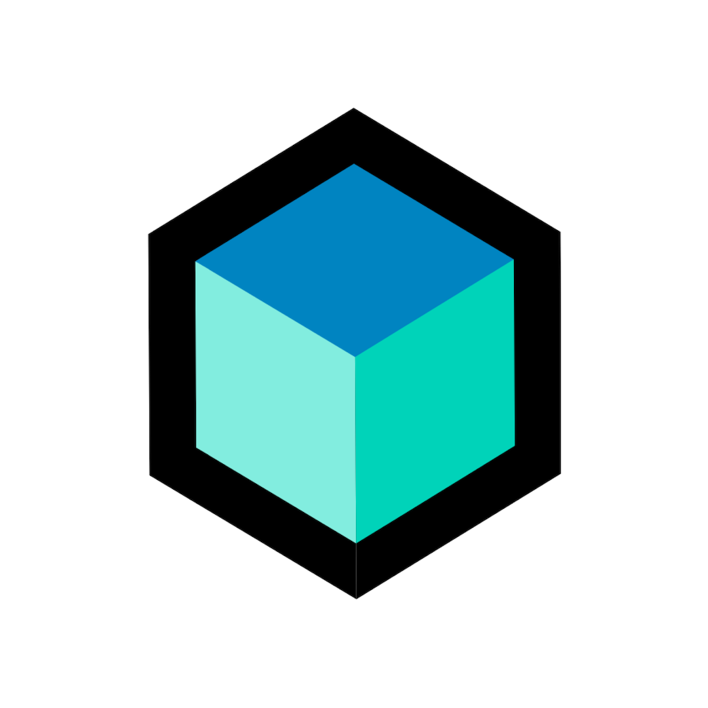

# My Projects
 This repositry contains documentation and description of all my projects

### Private (Description only).

<h2><a href="./swiss/README.md" style="text-decoration:none">
 SWISS.
</a></h2>

<h2><a href="./graduation_project/README.md" style="text-decoration:none">
 Study Space (Graduation Project).
</a></h2>

### Open Source (Description with source code).

<h2><a href="https://github.com/omar-hanafy/gym_bar/blob/master/README.md" style="text-decoration:none">
 Gym Bar.
</a></h2>

<h2><a href="https://github.com/omar-hanafy/gym_bar/blob/master/README.md" style="text-decoration:none">
 BLoC Examples.
</a></h2>

