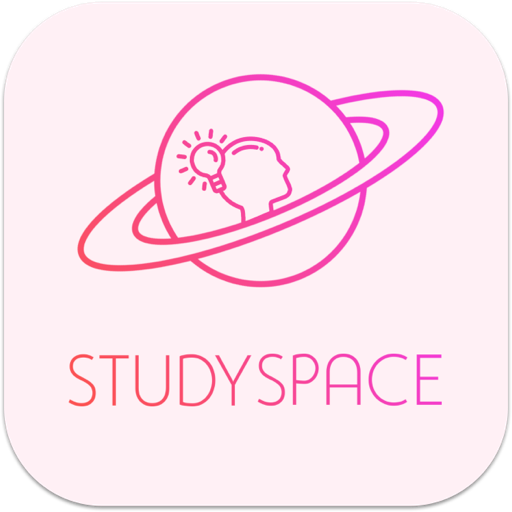
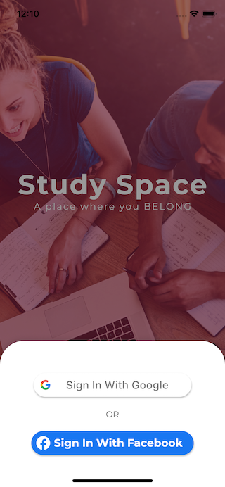

  

<h1 align="center">GYM BAR</h1>

<h2 align="left">ℹ️ About</h2>

Study Space is our graduation project mobile app that helps students all to !nd a place to study and share knowledge.

Study Space developed using flutter framework. It seeks to offer a better and
 more optimal solution for E-learning.

It allows students to work together to achieve a higher than ever learning curve.
 My job was dealing with the back-end developer by using the Restful APIs through JSON libraries, create an amazing UX/UI and implement social login buttons like Facebook, Google, and Twitter.

[Open Documentation Book For More Details](./graduation_project_book.pdf)

<h2 align="left">📱 App Preview</h2>

​                                                                       

## 📦 Packages used.

- all Firebase packages.
- http
- provider
- shared_preferences
- cached_network_image
- permission_handler
- contact_picker
- image_picker
- location
- chewie
- photo_view
- video_player
- pull_to_refresh
- sliding_up_panel

Reference: https://pub.dev.

## 🤝 Team Names.

Ali Hassan

Omar Khaled

Omar Nour

Tarek Mohamed

Zeiad Saleh

## 👨🏽‍💻 Who Am I.

I am Omar Khaled, I am a front-end mobile developer and I developed this app using the Flutter framework from Google.
